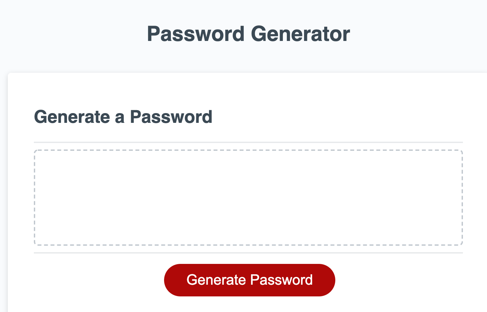
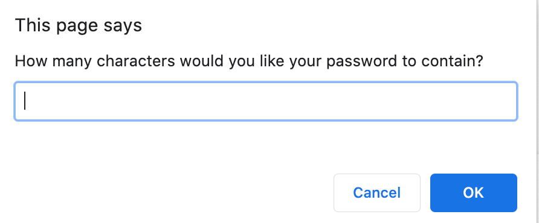
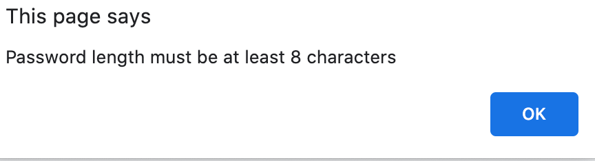
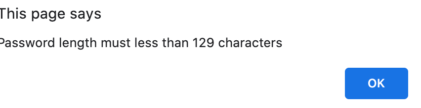
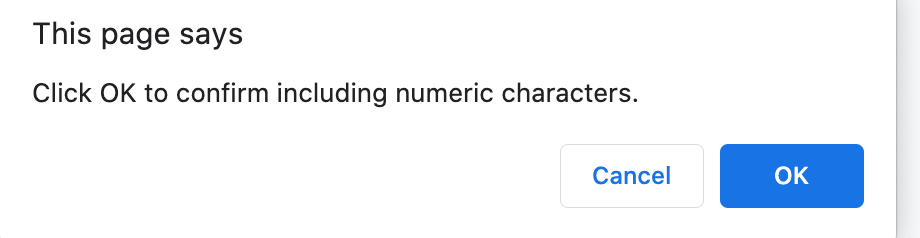
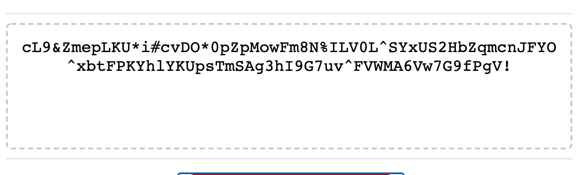

# Password-Generator-hw3

***Description***

This website was designed to generate passwords based off the users input. 



***Installation***

To access the password generator use the following html: 

https://github.com/imanid-code/Password-Generator-hw3


***Usage***

To accurately and effectively use the website the user must first click on the ```Generate Password  ``` button.


Next the user will be prompted to answer the first of 5 questions. First the user must choose a password legnth between 8-128 characters. 



If the user does not enter a number between 8-128 they will receive an alert that says either of the following: 




Followed by the previous prompt the user will be asked to confirm that it is OK to include special characters. The special characters include the following: !,@,#,$,%,^,&,*. 


The next prompt will ask the user to confirm that it is OK to include numeric character. The numeric characters include any number 1-9. 



Following the previous prompt,  there will be another prompt asking if it's OK to include lowercase letter (a-z). 


The final pop up will ask the user to confirm that it is OK to include  uppercase letter(A-Z).


If the user successfully answers all questoin the website will generate a password in the dotted line box. 



If  the user does ***NOT*** click OK to confirm one of the questions to include certain characters in the password , the password WILL still generate as long as they include atleast 1 of the 4 character choices(number,special character, upper or lower). 

If the user does NOT chose atleast of the 4 characters, the website will redirect them to the start. 


***Technology***

 ```Bootstrap```   ```HTML```   ```CSS```